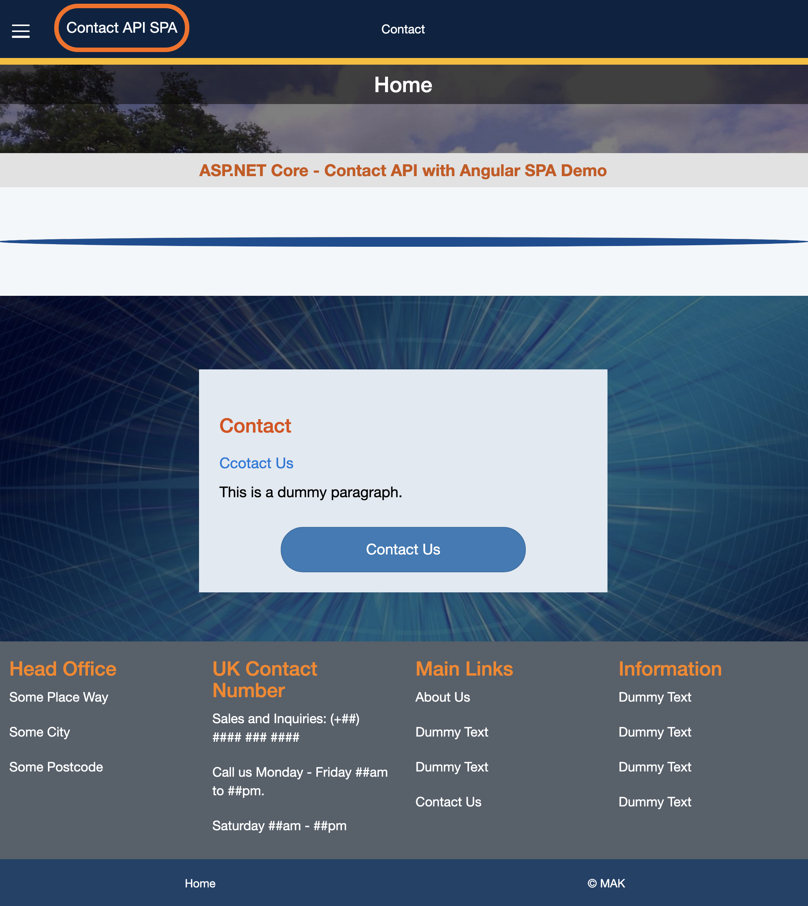
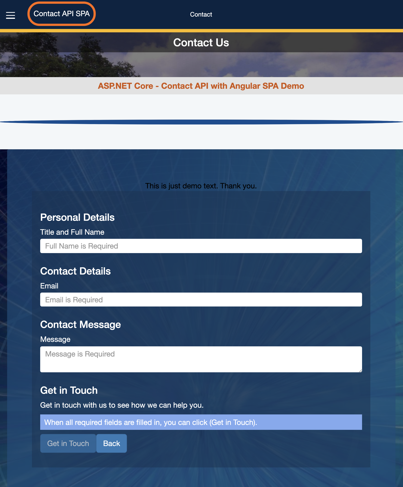
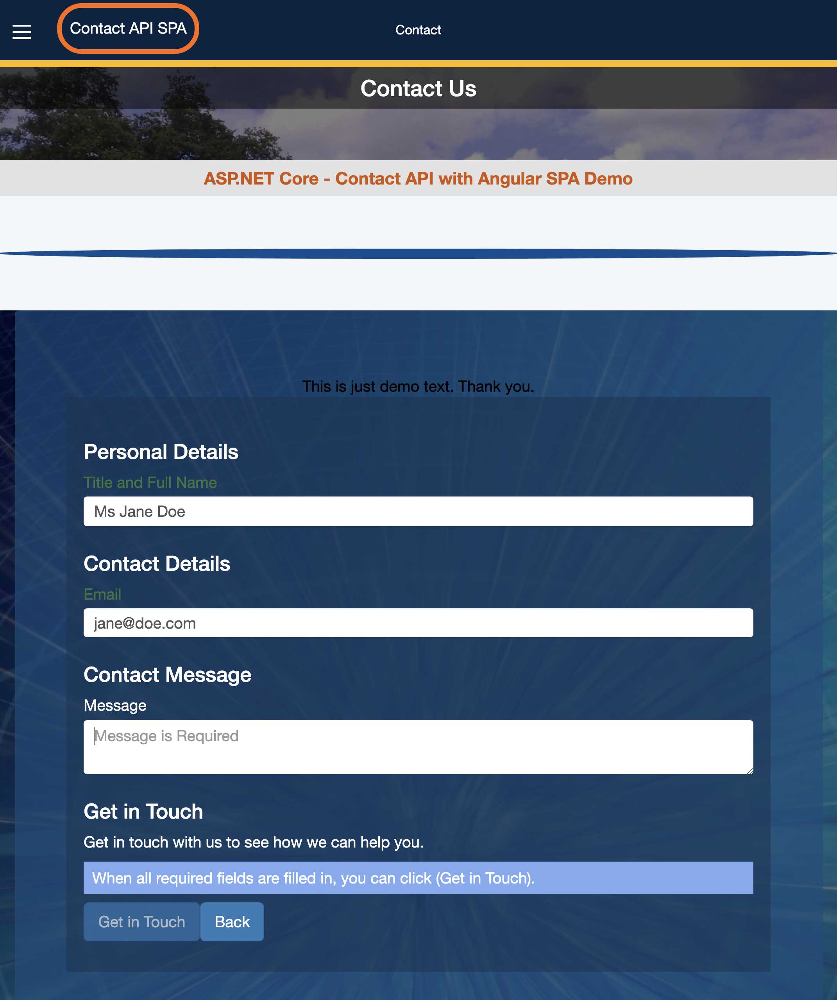
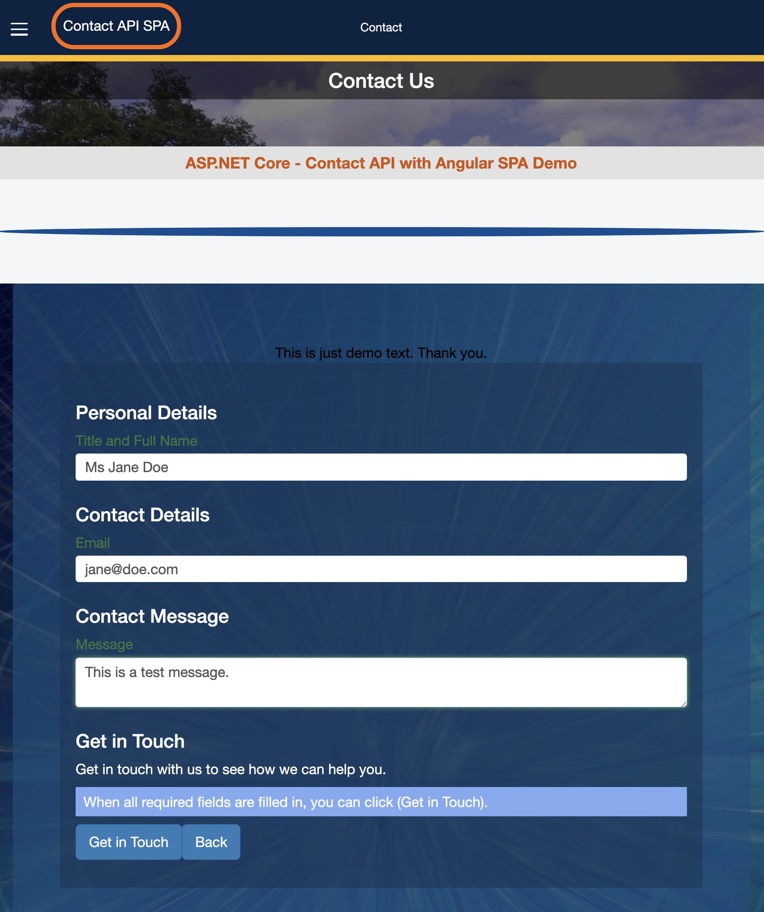
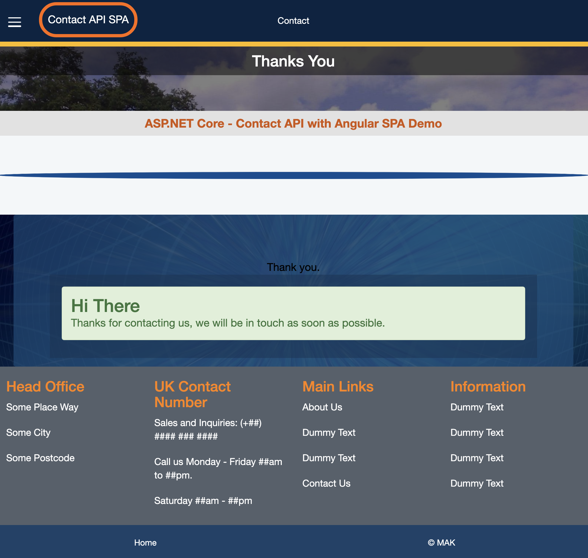

# Contact API with SPA

## ASP.NET Core MVC API & Angular

  <!-- Home Page : https://site.com/ -->
 

### This demo App uses Angular for the contact form and ASP.NET Core API to process the posted form and send an email.

Your will need to supply the required email/smtp data for this App to work.

Contact Page with Empty Form

Contact Page with Incomplete Form

Contact Page with Filled-in Valid Form

Contact Thank You Page

